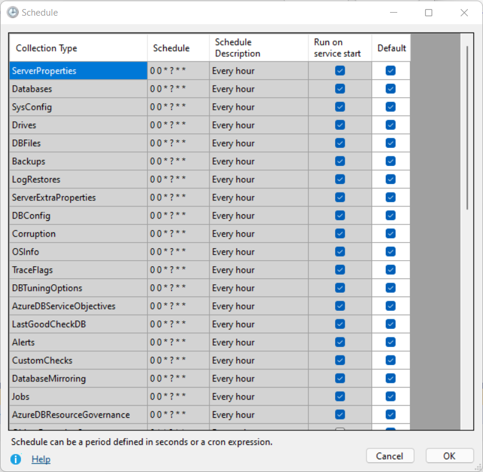

# Data Collection
## Notes
Data collection runs on a schedule by the agent which is listed below. Collections will also run on service start.  If you need to refresh data prior to the scheduled collection, the only only way to do this is to restart the DBA Dash service. 

*The refresh button in the GUI will refresh the data from the repository that has already been collected from the agent.  The agent collects data from your SQL Server instances.  The GUI tool only is just used to report on data from the repository database - it doesn't connect to your SQL instances directly.  The GUI tool is packaged with the agent but can also be deployed separately.*

## Schedule
### Every 1min
- [ObjectExecutionStats](../DBADash/SQL/SQLObjectExecutionStats.sql)
*Captures object execution stats from sys.dm_exec_procedure_stats, sys.dm_exec_function_stats & sys.dm_exec_trigger_stats*
- [CPU](../DBADash/SQL/SQLCPU.sql)
*Capture CPU utilization from sys.dm_os_ring_buffers or sys.dm_db_resource_stats (Azure).*
- [RunningQueries](RunningQueries.md)
*Captures a snapshot of queries currently executing. Captures blocking chains so replaces blocking snapshot. Also captures query text and optionally captures query plans*
- [IOStats](../DBADash/SQL/SQLIOStats.sql)
*Collects data from sys.dm_io_virtual_file_stats*
- [Waits](../DBADash/SQL/SQLWaits.sql)
*Collects data from sys.dm_os_wait_stats*
- [PerformanceCounters](../DBADash/SQL/SQLPerformanceCounters.sql)
*Collects data from sys.dm_os_performance_counters.  Collection can be [customized](OSPerformanceCounters.md), adding additional performance counters or collecting your own metrics with custom SQL.*
- [SlowQueries](../DBADash/SQL/SQLSlowQueries.sql) (Not enabled by default)
*Captures queries that take longer than 1second (or custom) to run using extended events*
- [JobHistory](../DBADash/SQL/SQLJobHistory.sql)
*Collects job execution data from msdb.dbo.sysjobhistory (just what's new since the last collection)*
- [DatabasesHADR](../DBADash/SQL/SQLDatabasesHADR.sql)
*Collects data from dm_hadr_database_replica_states if your SQL instance is using Always On Availability Groups.*
- [AvailabilityReplicas](../DBADash/SQL/SQLAvailabilityReplicas.sql)
*Collects data from sys.availability_replicas*
- [AvailabilityGroups](../DBADash/SQL/SQLAvailabilityGroups.sql)
*Collects data from sys.availability_groups*
- [MemoryUsage](../DBADash/SQL/SQLMemoryUsage.sql)
*Collects data from sys.dm_os_memory_clerks*
- ~~-[BlockingSnapshot](../DBADash/SQL/SQLBlockingSnapshot.sql)
*Captures a snapshot of any blocking/blocked queries currently running if the total wait time is more than 1second.
Replaced with RunningQueries*~~
#### Azure DB Only:
- [AzureDBElasticPoolResourceStats](../DBADash/SQL/SQLAzureDBElasticPoolResourceStats.sql)
*Collects data from sys.elastic_pool_resource_stats*
- [AzureDBResourceStats](../DBADash/SQL/SQLAzureDBResourceStats.sql)
*Collects data from sys.dm_db_resource_stats*
### Every Hour
- [ServerProperties](../DBADash/SQL/SQLServerProperties.sql)
*Various SERVERPROPERTY() function calls to get server property information.*
- [Databases](../DBADash/SQL/SQLDatabases.sql)
*Collect data from sys.databases*
- [SysConfig](../DBADash/SQL/SQLSysConfig.sql)
*Collect data from sys.configurations*
- [Drives](../DBADash/SQL/SQLDrives.sql) *(When not collected via WMI)*
*Drive collection is done via WMI if possible as this method can collect data from all volumes. The SQL collection method only collects drive capacity and free space for volumes that contain database files.*
- [DBFiles](../DBADash/SQL/SQLDBFiles.sql)
*Collects data from sys.database_files for every database. Uses sys.master_files to collect data for databases that are not accessible.*  
- [Backups](../DBADash/SQL/SQLBackups.sql)
*Get's the last backup of each type for every database from msdb.dbo.backupset*
- [LogRestores](../DBADash/SQL/SQLLogRestores.sql)
*Collects the last log file restored for each database*
- [ServerExtraProperties](../DBADash/SQL/SQLServerExtraProperties.sql)
*Collects server level data from various sources. Some data collections require SysAdmin permissions and xp_cmdshell - these will be skipped if not available.   e.g. Processor name, power plans & more*
- [DBConfig](../DBADash/SQL/SQLDBConfig.sql)
*Collect data from sys.database_scoped_configurations*
- [Corruption](../DBADash/SQL/SQLCorruption.sql)
*Collect data from msdb.dbo.suspect_pages, msdb.sys.dm_db_mirroring_auto_page_repair & msdb.sys.dm_hadr_auto_page_repair*
- [OSInfo](../DBADash/SQL/SQLOSInfo.sql)
*Collect data from sys.dm_os_sys_info*
- [TraceFlags](../DBADash/SQL/SQLTraceFlags.sql)
*Gets trace flags that are enabled globally with DBCC TRACESTATUS(-1)*
- [DBTuningOptions](../DBADash/SQL/SQLDBTuningOptions.sql)
*Returns data from sys.database_automatic_tuning_options for each database*
- [LastGoodCheckDB](../DBADash/SQL/SQLLastGoodCheckDB.sql)
*Note: This collection requires SysAdmin permissions*
- [Alerts](../DBADash/SQL/SQLAlerts.sql)
*Collect data from msdb..sysalerts*
- [CustomChecks](../DBADash/SQL/SQLCustomChecks.sql)
Add [your own](CustomChecks.md) checks to DBA Dash.
- [DatabaseMirroring](../DBADash/SQL/SQLDatabaseMirroring.sql)
*Collect data from sys.database_mirroring*
- [Jobs](../DBADash/SchemaSnapshotDB.cs)
*Collects metadata for SQL Agent jobs including a DDL snapshot using SMO. A lightweight check is run every hour to see if any jobs have been modified since the last collection. If any jobs have been modified, the collection will run.  The lightweight check won't detect some changes like changes to job schedules.  After 24hrs, the collection is run even if no modification to jobs is detected.*  
- ~~- [AgentJobs](../DBADash/SQL/AgentJobs.sql)~~
 *Replaced with Jobs/JobHistory*
 
#### Azure DB Only:
- [AzureDBServiceObjectives](../DBADash/SQL/SQLAzureDBServiceObjectives.sql)
*Collects data from sys.database_service_objectives*
- [AzureDBResourceGovernance](../DBADash/SQL/SQLAzureDBResourceGovernance.sql)
*Collects data from sys.dm_user_db_resource_governance*

### Daily @ Midnight
- [ServerPrincipals](../DBADash/SQL/SQLServerPrincipals.sql)
*Collects data from sys.server_principals*
- [ServerRoleMembers](../DBADash/SQL/SQLServerRoleMembers.sql)
*Collects data from sys.server_role_members*
- [ServerPermissions](../DBADash/SQL/SQLServerPermissions.sql)
*Collects data from sys.server_permissions.*
- [DatabasePrincipals](../DBADash/SQL/SQLDatabasePrincipals.sql)
*Collects data from sys.database_principals for each database*
- [DatabaseRoleMembers](../DBADash/SQL/SQLDatabaseRoleMembers.sql)
*Collects data from sys.database_role_members for each database*
- [DatabasePermissions](../DBADash/SQL/SQLDatabasePermissions.sql)
*Collects data from sys.database_permissions for each database*
- [VLF](../DBADash/SQL/SQLVLF.sql)
*Gets the Virtual Log File Count for each database.* 
- [DriversWMI](../DBADash/DBCollector.cs)
*Collects driver information from Win32_PnPSignedDriver via WMI.*  
- [OSLoadedModules](../DBADash/SQL/SQLOSLoadedModules.sql)
*Collects data from sys.dm_os_loaded_modules - can be used to check if antivirus has loaded into SQL Server address space*
- [ResourceGovernorConfiguration](../DBADash/SchemaSnapshotDB.cs)
*Scripts resource governor configuration using SMO*
- [DatabaseQueryStoreOptions](../DBADash/SQL/SQLDatabaseQueryStoreOptions.sql)
*Collects data from sys.database_query_store_options for each database*

### Daily @ 11pm
- [Database Schema Snapshots](../DBADash/SchemaSnapshotDB.cs) (Not enabled by default)
*Creates a schema snapshot of databases using SMO. This only runs for the databases listed in SchemaSnapshotDBs - schema snapshots won't run unless this option has been set.  See [here](SchemaSnapshots.md) for more info.*

## Schedule Customization

The application has a default schedule listed above which aims to provide a good balance for most instances. If you increase the frequency of data collection, you will increase the monitoring impact and it could also increase the size of your DBA Dash repository database.  Less frequent collection could mean that the data is stale or doesn't provide enough granularity for performance troubleshooting.
If you need to adjust the default schedule to better meet your needs, this can be done using the DBA Dash Service Config tool.  In the Options tab click "Configure Schedule".

If you want to override the default schedule, uncheck "Default" and enter a string with your own schedule.  The string can either be a [cron expression](#cron-expressions) or a duration specified in seconds.  To disable a collection, use a blank string.  

There is also the option to configure the collection to run on service start.  Restarting the service is an option if you need to manually refresh data before the scheduled collection runs.

If you configure the schedule in the options tab it will apply to all the monitored SQL instances for that agent.  If you want to adjust the schedule for a specific instance, click the "Source" tab.  In the "Existing Connections" grid, click the "Schedule" link to edit the schedule for a specific instance.  Any collections you don't override the schedule for will be inherited from the agent level configuration described earlier or from the built in application default values.  

Note:
_Collections that share the same schedule will be collected together.  For example, CPU, performance counters, waits etc might all share the same 1min collection schedule.  Every 1min, a job will be triggered to collect this data (serially) rather than separate triggers firing at the same time for each collection.  A separate job is used for each monitored SQL instance and each schedule._

The schedule data is saved in the ServiceConfig.json for any collections that you have overridden from the default values. The application defaults are configured in [this source file](../DBADash/CollectionSchedule.cs).

## Cron Expressions

Schedules can be configured in DBA Dash using cron expressions or you can enter a value in seconds.  
### Examples

**Cron:**
`0 * * ? * *` Every 1min
`0 0/5 * ? * * *` Every 5min
`0 0/10 * ? * * *` Every 10min
`0 0/15 * ? * * *` Every 15min
`0 0/30 * ? * * *` Every 30min
`0 0 * ? * *` Every hour
`0 0 0/2 ? * *` Every 2hrs
`0 0 0 1/1 * ? *` 12am
`0 0 23 1/1 * ? *` 11pm
**Time in seconds:**
`300` Every 5min (300 seconds)  
`60` Every 1min (60 seconds)
`30` Every 30 seconds
*(Execution times will vary based off when the service is started.  Use a cron expression if you need more control over the actual execution time)*

Cron expressions might seem cryptic but they provide a lot of flexibility for scheduling.  DBA Dash uses [Quartz.NET](https://www.quartz-scheduler.net/) for scheduling which provides some [good documentation](https://www.quartz-scheduler.net/documentation/quartz-3.x/tutorial/crontriggers.html#example-cron-expressions) on cron expressions.  The java version of Quartz also has a good [cron trigger tutorial](http://www.quartz-scheduler.org/documentation/quartz-2.3.0/tutorials/crontrigger.html). Or you can learn more on the [wiki page](https://en.wikipedia.org/wiki/Cron).  There are also some useful online cron expression generators if you need a complex schedule but don't have time to learn the syntax.

Tip: DBA Dash has a "Schedule Description" column that you can use to validate your cron expression.
### Cron Generators

* [freeformatter.com](https://www.freeformatter.com/cron-expression-generator-quartz.html#crongenerator)
* [crontab.cronhub.io](https://crontab.cronhub.io/)

