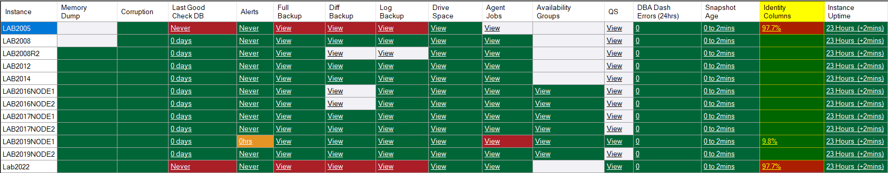
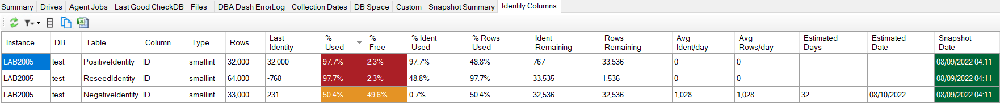
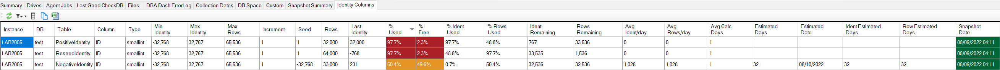
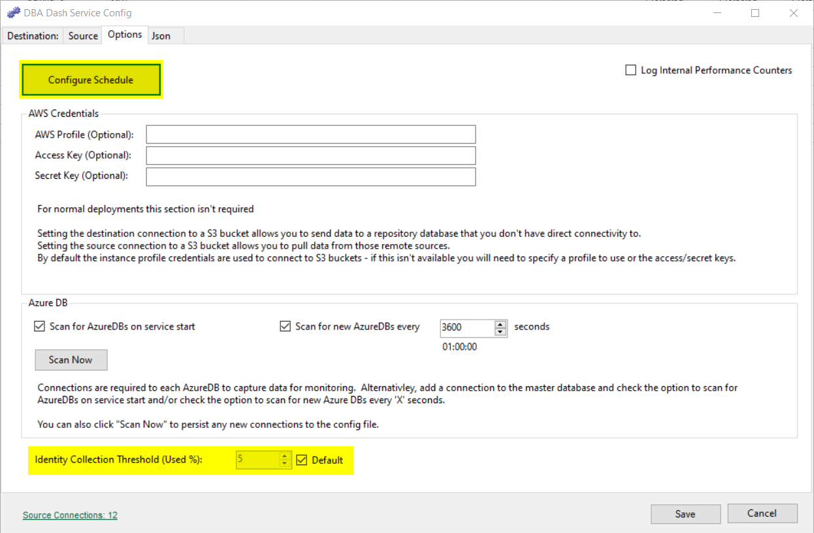

# Identity Columns

Collects last identity value and row count for tables with identity values exceeding the capture threshold for % used. The identity column collection is used to check for tables that are close to running out of identity values.  You can see which instances have tables with identity values near the limit on the Summary tab.

## Drilldown example

The summary tab allows you to drill down to see which tables are affected.

Additional columns are available by clicking the Columns button in the toolbar.

### PositiveIdentity Table

The *PositiveIdentity* table started with identity value 1 and had 32K rows inserted.  As this is a smallint type the maximum possible value is 32,767 so we are approaching the limit for this table (97.7% used).  We have only used 48.8% of the total possible number of rows as the smallint type goes from -32768 to 32767 if we include the negative address space.

### ReseedIdentity Table

The *ReseedIdentity* table last identity value is -768 so based on this alone you would assume there is plenty of available identity values.  Unfortunatly this table was initially started at identity value 1 with 32K rows inserted.  The identity value was reseeded with -32,768 to allow more rows to be inserted by utilizing the negative address space.  An additional 32K rows were inserted so we have 64K rows total. This is 97.7% of the total number of rows and we will have issues with duplicate values once the identity value gets back to 1.  The used % is showing the percentage of rows used instead of the % of identity values used as the value is higher in this case. 

### NegativeIdentity Table

The *NegativeIdentity* table was started with the minimum value of -32,768.  A total of 33K rows have been inserted and the % used is also the % of rows instead of the % of identity values as the row count is higher.  The % Ident used is 0.7% as it's calculated based on the positive identity values available with the Last Identity been a positive value in this case. A negative last value would cause the used identity % to be calculated over the max number of rows.

## Prediction

DBA Dash can predict when you will run out of idenity values.  It keeps track of the last idenity value and row count over time.  This is used to work out the average rows/identity values used per day.  The oldest snapshot available created within the last 31 days is compared to the current snapshot. The difference in row counts and last identity is then divided by the time in days between the collections to work out the average per day.  The daily average is then used to predict when the table will run out of identity values.

## Collection

The default collection runs daily at 12AM.  You can edit the schedule using the Options tab in the service configuration tool.  You can also adjust the threshold for collection on the Options tab.  By default the application will collect data for tables with 5% used identities.

### Collection Query

DBA Dash will run this query on your monitored instances to collect data for identity columns:

[Collection query](DBADash/SQL/SQLIdentityColumns.sql)

## Threshold configuration

The collection threshold is configured in the Options tab on the service configuration tool (default 5% used).  This is used to reduce the amount of data collected while keeping the threshold low to allow tables to be monitored when there is potential for running out of identity values.

The default warning threshold is configured at 50% and the critical threshold is configured at 80%.  These thresholds can be adjusted using the dbo.IdentityColumnThresholds table in the repository database.  The thresholds can't be adjusted in the GUI at this point in time.

