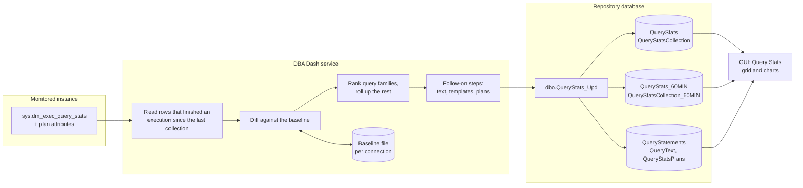

# Query Stats

Query Stats records statement-level resource usage from the plan cache (`sys.dm_exec_query_stats`): which statements used the CPU, duration, reads, writes, executions and memory grants in each interval, under which plans. It sits below Object Execution Stats, which works at procedure level: the useful answer here is *which statement inside the procedure*, because that is the thing you can fix.

This document describes how the collection works and why it is built the way it is. Most of the complexity comes from one constraint: **the totals for an interval must add up to the work the instance actually did**, while the amount collected, sent and stored stays bounded.

---

## Contents

- [Overview](#overview)
- [Turning it on](#turning-it-on)
- [Collection](#collection)
- [Diffing against the baseline](#diffing-against-the-baseline)
- [Statement identity](#statement-identity)
- [Ranking and rollups](#ranking-and-rollups)
- [Follow-on steps: text, templates and plans](#follow-on-steps-text-templates-and-plans)
- [Import](#import)
- [Storage and retention](#storage-and-retention)
- [Reporting](#reporting)
- [Configuration reference](#configuration-reference)
- [Internal performance counters](#internal-performance-counters)
- [Testing](#testing)
- [Limitations](#limitations)
- [Code map](#code-map)

---

## Overview



The plan cache only holds cumulative counters, per cached plan, per statement, since the plan compiled. So:

1. **The service diffs, not the repository.** Each collection reads the plan cache at its native grain - one row per cached plan per statement - and subtracts the previous snapshot of the same row (the *baseline*, kept in a file beside the service). Sending the raw grain would mean thousands of rows per instance per interval just to compute a few hundred, and holding a baseline for every one of them in the repository.
2. **Rank after diffing.** Statements are grouped into *families* (query shapes), ranked on the interval's delta by several measures, and the top N are kept in detail.
3. **Roll up rather than drop.** Everything that missed the cut is summed into rollup rows, so the interval's totals stay complete.
4. **Say what you couldn't see.** Each collection writes a row describing itself - how long it covered, what it couldn't attribute, whether it was skipped - so a report can say how complete a window is instead of implying it.

---

## Turning it on

The collection is off by default. Setting a top N (`QueryStatsTopN`) switches it on: in the service config tool, on the **Query Stats** tab when adding connections (with a link there to apply it to every existing connection), or per connection in the **Query Stats Top N** column of the grid. Reading `sys.dm_exec_query_stats` walks the plan cache, so its cost depends on the size of that cache rather than on anything the query can filter. That is a decision to make per connection rather than impose on every upgrade.

The default schedule is every 5 minutes (`CollectionSchedule`), not on service start. As for other collections, its collection dates thresholds default to ones derived from the schedule it runs on.

Plan capture is on by default once the collection is on, capped at 50 plans per collection - see [plans](#plans).

---

## Collection

`DBCollector.CollectQueryStatsAsync` runs the source query [`SQLQueryStats.sql`](../DBADash/SQL/SQLQueryStats.sql) and streams the reader straight into `QueryStatsProcessor.Process` - no `DataTable` of the raw rows is built, because a busy plan cache would cost tens of megabytes per collection per instance for rows that mostly only need to be hashed and diffed.

### The source filter

The query returns only rows whose **last execution finished** since the previous collection:

```sql
WHERE DATEADD(SECOND, CONVERT(INT, qs.last_elapsed_time / 1000000) + 1, qs.last_execution_time) >= @FromLocal
```

- **Why this is safe.** The counters only move when an execution finishes, so a row whose last execution finished before the interval has a delta of zero by definition. Nothing excluded this way could have contributed.
- **Why the finish, not `last_execution_time`.** `last_execution_time` is when the last execution *started*. An execution that started before the previous collection and finished after it changes the counters while its start time sits behind the filter - exactly the long executions this collection most needs to see. The finish is computed in whole seconds, rounded up, because `DATEADD` takes an `INT` and elapsed time in microseconds overflows it after 35 minutes.
- **Why not filter on the counters.** Filtering or ranking by cumulative values (`TOP N BY total_worker_time`, say) in the source query is not safe. A long-cached plan with a large lifetime total but nothing recent would be returned, while a plan whose *recent* work was large but whose lifetime total was not would be excluded and its work lost - from the detail and from the rollups. And a row that crosses such a threshold between snapshots arrives with no baseline, so its counters can't be diffed. Ranking happens on the delta, after diffing.

### Plan attributes

The database and object come from `sys.dm_exec_plan_attributes`, because `sys.dm_exec_sql_text` returns a NULL database for ad hoc and prepared plans. Attributes belong to a plan, not a statement, so the filtered rows are materialised first and the attributes looked up **once per plan** - a procedure with twenty statements costs one call, not twenty. `set_options` comes from the same call: whether `QUOTED_IDENTIFIER` was on decides whether a double-quoted token in an ad hoc text is an identifier or a string, which [templates](#templates) need to know. The object id attribute is only meaningful for module plans (`sql_handle` prefix `0x03`); for an ad hoc plan it is a hash of the batch text.

### Version-dependent columns

`total_rows` (2008 R2+), `total_dop`, `total_grant_kb`, `total_used_grant_kb` and `total_spills` (2016+) are added with `COLUMNPROPERTY` tests. A counter the instance can't supply stays **NULL** all the way through - in the delta, the hourly rollup and the reports ("n/a") - because zero would read as "no spills" when the truth is "cannot tell".

Every statement in the source query uses `OPTION (RECOMPILE)` so the collection doesn't add plans to the cache it is reading.

### Backing off a slow read

If the previous read took longer than `QueryStatsMaxReadDurationMs` (default 5,000 ms), the next interval is skipped: a collection row is written with `IsSkipped = 1` and the recorded duration is cleared. While the problem lasts, the collection runs every other interval rather than being disabled silently or hammering the instance. The previous read is the only available predictor of the next one's cost, and a plan cache large enough to make it expensive is a property of the instance rather than a blip.

---

## Diffing against the baseline

### The baseline

A `Baseline` ([`QueryStatsBaseline.cs`](../DBADash/QueryStats/QueryStatsBaseline.cs)) holds, per connection, the previous snapshot of every plan cache row the collection has seen:

- **Key** - `BaselineKey`: the plan handle and statement offsets, reduced to 128 bits by two FNV-1a passes. The handle itself is never stored, cutting an entry from around a hundred bytes plus an allocation to a 16-byte struct. The plan handle is in the key rather than the `sql_handle` because the same ad hoc text run in two databases has one `sql_handle` and two plan handles; keying on the `sql_handle` would merge two databases' counters into one meaningless delta.
- **Entry** - `BaselineEntry`: the counters, the lifetime maximum elapsed time, `creation_time`, `plan_generation_num` and when the row was last seen. Unsupported counters are a `-1` sentinel, so the entry stays a flat struct of longs.
- **Cap** - `QueryStatsBaselineMaxEntries` (default 20,000, about 160 bytes each). The least recently seen entries are evicted first, and the eviction count travels with the collection (`BaselineEvictions`), so a cap set too low shows up as a data quality figure rather than as quietly missing load.

`QueryStatsBaselineStore` keeps one baseline per connection in memory and in a file under `QueryStatsBaselines` beside the service binary. The file is written to a temporary name and moved into place, so a process kill can't leave a corrupt file. An unreadable file costs one interval of attribution, not the history. Baselines are deliberately not stored on the monitored instance or in the repository.

### The four cases

For each row read, `Process` decides what the interval's delta is:

| Case | Condition | Delta |
|---|---|---|
| **Diff** | In the baseline with the same `creation_time` and `plan_generation_num`, and no counter went backwards | Current minus previous |
| **Compiled inside the interval** | `creation_time` is after the interval started | The whole of the counters (`IsCompile = 1`) |
| **Would have been seen** | Missing from (or recompiled since) a baseline that has kept a complete record since before the row compiled | The whole of the counters |
| **Unattributed** | Anything else: no baseline, compiled before the interval | Not attributed to a statement - estimated, see below |

The third case is what catches a long execution that started before the previous read and finished after it. `Baseline.WouldHaveSeen` is true only when the baseline has been kept without a break since before the row compiled (`ContinuousSinceUtc`) and nothing compiled that late has been evicted (`EvictedThroughUtc`). Every collection reads every row that finished an execution since the previous one, so a row missing from such a baseline has not finished anything before - all its counters belong to this interval. It doesn't apply when only the generation number moved: a row seen at that compile time may still carry counters the previous delta already took.

A counter that went backwards with an unchanged compile time and generation number means the row was reset, so it is not diffed.

**Unattributed work** is counted rather than dropped, on the collection row (`UnattributedWorkerTime`, `UnattributedElapsedTime`, `UnattributedExecutions`), as an estimate of the interval's share rather than the plan's whole life in cache - which on a first collection would swamp the interval's own work. The last execution finished inside the interval and counts in full; the earlier executions are prorated over the time since the plan compiled:

```
share = (last finish - interval start) / (last finish - creation_time)
```

That is right for a job that runs once a day, whose earlier runs share nothing with the interval, and for a query running all day at a steady rate.

### The slowest execution

The DMV holds totals and a lifetime maximum, not each execution. The slowest execution *known* to have finished in the interval is the largest of: the average in the delta; the last execution (which the filter keeps inside the interval); and `max_elapsed_time` where the row was taken whole or the maximum rose since the previous collection. It is a floor on the true slowest - a slow run among faster ones that set no new maximum can't be seen from this DMV. Slow Queries is the collection that records every slow execution.

### Moving the baseline on

The processor has no side effects: it returns the pending baseline with its result. `QueryStatsBaselineStore.Apply` moves the baseline on and saves it **before the data is written** - the opposite of the deadlock and slow query cursors, which only move once the write succeeds. Those can re-read safely because the repository dedups what comes back. A delta can't be deduped: one that covered an interval already stored would count its work twice, and a write can fail after part of it has landed. So a failed write costs its own interval as a gap, which the coverage figures show, and the scheduled collection's data is still in the failed message folder - importing that later fills the gap exactly once.

Everything from the read to `Apply` runs under `QueryStatsBaselineStore.LockAsync(connectionID)`, so a triggered collection landing on top of a scheduled one diffs against the first one's result instead of reporting the same interval twice.

### Gaps

If the previous collection is older than the maximum lookback, the baseline is discarded and the run behaves as a first collection (`Baseline.DiscardIfStale`). Diffing against entries days old would report days of work as one interval - every plan compiled during the gap would count as compiled inside it. A gap should read as a gap, not a spike. The lookback is `QueryStatsMaxLookbackMinutes` (default 60), but never less than three of the schedule's longest normal gaps (`Baseline.GetMaxLookback`), so an hourly schedule doesn't discard its baseline on every run.

`PeriodTime` on every row is the time since the previous successful collection, not a fixed interval, so a missed collection describes itself: the next delta covers the whole gap and says how long it was.

On a **first collection** (no baseline, `IsFirstCollection = 1`), the interval is taken as the default 5 minutes: plans compiled in that window are attributed, and the rest is estimated as unattributed.

---

## Statement identity

### Statement types

| Type | Name | Identified by | Notes |
|---|---|---|---|
| 0 | `AdHoc` | Database, `sql_handle`, offsets | An ad hoc or prepared statement with **no** `query_hash` |
| 1 | `Module` | Database, schema, object name, offsets | Not the handle: a module `sql_handle` contains the `object_id`, which changes when the object is dropped and recreated, so a handle-keyed history would split at every redeploy |
| 2 | `OtherQueries` | Database | Rollup: every family that missed the ranking, per database |
| 3 | `OtherVariants` | Database, `query_hash` | Rollup: a kept family's statements past the per-family cap |
| 4 | `OtherDatabases` | - | Rollup: the `OtherQueries` rows of the databases past the cap on them |
| 5 | `AdHocShape` | Database, `query_hash` | Every literal variant of an ad hoc query as one statement |

**Why ad hoc statements are shapes.** An ad hoc `sql_handle` is a hash of the batch text, so every literal value makes a new one. A query sending its values as literals would otherwise be a new statement - and a new batch text - for every value it ran with: a history of single points. Keyed by database and `query_hash`, all its variants are one statement with one history. The handle and offsets stored with a shape are one variant's, kept as an *example*.

The repository computes `StatementKey` in `dbo.QueryStats_Upd` as `SHA2_256` (truncated to `BINARY(20)`) of a type-specific string, unique per instance. A single computed key turns what would be a join with one OR branch per type into one equality. `CONCAT` is used deliberately: a NULL (an unresolved database, say) becomes an empty string, so the row still gets a stable key rather than matching nothing.

### Families

A *family* is a query shape within a database: statements sharing a `query_hash`. A family is usually one statement - the literal variants of an ad hoc query are one statement already - and spreads only where the same query sits in several procedures, or in a procedure and in ad hoc SQL. A statement with no hash (some statement types have none) is its own family rather than being lumped in with every other hashless statement.

### Templates

An ad hoc shape stands for many texts, so it is never shown as one variant's text: that would present the variant's literal values as though every execution had used them, when the values are what decide how many rows an execution touches. It is shown as a **template** made by `QueryTemplate.Create` ([`QueryTemplate.cs`](../DBADash/QueryStats/QueryTemplate.cs)): the example's statement with literals replaced - strings `'?'`, Unicode strings `N'?'`, numbers `?`, money `$?`, binary `0x?` - and comments removed (they aren't part of the hash, and an application tagging each request with a trace id makes them as variable as any literal). Layout is kept.

The masking is lexical and follows the T-SQL tokenizer: doubled quotes inside strings and delimited identifiers, nested block comments, digits inside identifiers (`Table1`, `@p1`), and double quotes, which are identifiers or strings depending on `QUOTED_IDENTIFIER` (taken from the example plan's `set_options`). The only mistake it can make is to hide something every variant shared (a `varchar(10)` length, an `ORDER BY` ordinal), never to show a value that varied. `sp_get_query_template` does much the same on the server, but only for statements forced parameterization would accept, and at the cost of a call per statement on the monitored instance.

The shape's example batch is still available - one click away, labelled as an example both in the UI and in a `/* */` note at the top of the text (`dbo.QueryStatementBatchText_Get`).

---

## Ranking and rollups

After diffing, `QueryStatsProcessor` groups statements into families and keeps a family if it is in the top `QueryStatsTopN` by **any** of seven measures, computed on the interval's delta:

1. Worker time (CPU)
2. Elapsed time
3. Logical reads
4. Logical writes
5. Physical reads
6. Executions
7. Memory grant **per execution** - not the total, which grows with how often a query runs and would rank a small grant executed often above a large one executed once

A family is also kept, whatever the ranking, if its slowest known execution reached `QueryStatsSingleExecutionThresholdMs` (default 1 s): one expensive run a day is exactly what a top N by total would hide. Ranking on several measures is what stops a write-heavy or memory-hungry query from being invisible because it doesn't use much CPU. The kept count lands between N and 7 × N, usually near the low end because heavy queries top several measures at once.

What isn't kept is rolled up, never dropped:

| Level | Kept | Rest becomes |
|---|---|---|
| Families | Top N by any measure, plus slow executions | One `OtherQueries` row per database |
| Databases (rollup rows) | Top N databases by CPU | One `OtherDatabases` row - an instance hosting thousands of databases would otherwise write a rollup row for each, every interval |
| Statements in a kept family | Top `QueryStatsMaxStatementsPerFamily` (3) by CPU | One `OtherVariants` row per family |
| Plans of a kept statement | Top `QueryStatsMaxPlansPerStatement` (5) by CPU | One row with `IsOtherPlans = 1` and plan hash `0x0` |

The order is not interchangeable: diff first, at the grain the counters accumulate at (a plan evicted between snapshots makes any pre-aggregated total fall); rank second, on the delta (a query crossing a threshold between snapshots would otherwise read as a spike); roll up third, so the interval's totals survive the truncation. `QueryStatsProcessorTests.TotalsSurviveRankingAndRollup` guards the claim.

A statement that ran under two plan shapes in an interval is **two rows** (one per `query_plan_hash`), so a plan regression is visible rather than inferred.

---

## Follow-on steps: text, templates and plans

After the statistics are processed, `DBCollector.CollectAsync` runs three more steps. Each is timed as its own internal counter (see [counters](#internal-performance-counters)), not as part of the collection's duration. Each is capped per collection and works heaviest first, so a cap that bites - after a service restart, when nothing has been sent yet - leaves the cheapest for the following intervals rather than skipping what matters. What each step has sent is remembered in the service's `MemoryCache`, but only once the data has been written to its destination (`CacheCollectedText`, `CacheCollectedPlans`, called by `WorkItem` after the write).

### Text

Batch text for the statements that were stored (not the ones rolled up), one handle per batch, capped by `QueryStatsTextHandlesPerCollection` (default 100). It is fetched by the same path Running Queries uses and goes into the shared `dbo.QueryText` table, cached by `sql_handle`. Shapes are excluded: their example handle is a different variant from one interval to the next, so fetching it would store a new batch per shape per interval.

### Templates

For ad hoc shapes that haven't had a template sent (`CollectQueryStatsTemplates`), capped by the same setting. The example's batch is fetched, the statement cut out with its offsets (`QueryTemplate.GetStatementText`, mirroring the repository's arithmetic), masked, and written onto one of the shape's rows with the batch itself (`StatementTemplate`, `ExampleBatchText`). Not through the text step: that would store the example batch whether or not the repository already had a template, leaving orphaned batches behind every time a shape is resent. The repository stores the batch only when it takes the template.

Cached by connection, database and `query_hash` with a **1-day absolute** expiry. Absolute rather than sliding, because a sliding entry for a shape seen every interval would never lapse, and a template lost on the way (in a collection the repository refused, say) would never be resent.

### Plans

The plans of the plan shapes that were stored (`CollectQueryStatsPlansAsync`), capped by `QueryStatsPlansPerCollection` (default 50; 0 switches plan capture off). Optionally limited to rows whose CPU in the interval reached `QueryStatsPlanCPUThresholdMs` (default 0: every row the ranking kept). With no threshold, every plan shape that has stored statistics gets a plan, so plan coverage matches the history: a statement that was kept before a regression has its earlier plan as well as the new one. A CPU threshold would break that, leaving the history from before the regression without its plan. A statement that wasn't kept before a regression has no history in Query Stats to compare against - its work was rolled up - so its earlier plan has to come from Query Store, which keeps plan history whatever the cost.

- **Which plan.** The processor remembers, for each kept plan shape, the cache entry that did the most work under it in the interval (`PlanExample`). Every entry under one `query_plan_hash` runs the same operators, so that entry's plan stands for the row - but its estimates and compiled values are its own, and for an ad hoc shape so are its statement text and literal values. Rollup rows and `IsOtherPlans` rows have no plan of their own; a plan hash of zeros has nothing to fetch.
- **Fetching.** `Plan.GetPlansAsync`, the fetch Running Queries uses: `sys.dm_exec_text_query_plan` with the statement offsets, in batches (the fetch lists entries in a `VALUES` clause), GZip-compressed in the service, with the plan hash read back from the plan XML. A plan whose hash doesn't match the row's - the entry recompiled to another shape between the read and the fetch - is discarded.
- **Remembering.** By statement and plan shape (`QueryStatsPlan|connection|statement key|plan hash`), not by cache entry: a shape's heaviest entry is a different variant almost every interval, so an entry-keyed cache would fetch every shape's plan every interval. 1-day absolute expiry, as for templates. A plan that couldn't be fetched (evicted, recompiled, encrypted module) waits an hour before being tried again, so a plan that never stays cached doesn't take a place under the cap every interval.
- **Storing.** The compressed plan travels on its stats row (`query_plan_compressed`) and `dbo.QueryStats_Upd` stores it in `dbo.QueryStatsPlans`, keyed by `(StatementID, query_plan_hash)` - the grain of the fact tables, so any row of `QueryStats` or `QueryStats_60MIN`, or of a report over them, finds its plan by its own key. The first plan received for a shape is kept.
- **On demand.** A row whose plan wasn't captured (past the cap, plan capture off, or captured before the feature) shows **Find** in the grid. Clicking it sends a `QueryStatsPlanMessage` through messaging: [`SQLQueryStatsPlan.sql`](../DBADash/SQL/SQLQueryStatsPlan.sql) finds a cache entry under the row's plan shape - by `sql_handle` and offsets, or for a shape by `query_hash`, in the statement's database - and fetches its plan the same way. The plan is saved with `dbo.QueryStatsPlan_Add` so it is there next time. Without messaging the grid shows a script that does the same lookup. Query Store, through the Plan Hash link, remains the source for plans no longer cached.

`dbo.QueryPlans` (Running Queries) is a separate store: it is keyed per cache entry rather than per statement and plan shape, and kept for the Running Queries retention rather than the statement's. Some plans are stored in both. The duplication is bounded by the size of `QueryStatsPlans`, and removing it would tie the two features' purges together.

---

## Import

`DBImporter.UpdateQueryStatsAsync` passes the two tables to `dbo.QueryStats_Upd` as table-valued parameters (`dbo.QueryStats`, `dbo.QueryStatsCollection`). **Column order matters**: SqlClient binds a `DataTable` to a TVP by ordinal, so `QueryStatsTables` and the table types must list the same columns in the same order. `QueryStatsTableContractTests` checks this, and that every column on the type has somewhere to go. Columns are added at the end.

[`dbo.QueryStats_Upd`](../DBADashDB/dbo/Stored%20Procedures/QueryStats_Upd.sql) does no arithmetic on counters; it resolves identity and inserts:

1. **Overlap check.** A collection whose period overlaps one already stored for the instance is refused, with a warning in `CollectionErrorLog` rather than an error (an error would be retried, then the whole file treated as a failed import that no retry can import). The baseline moves on before each write, so each collection's period starts where the previous one ended and a re-import of the same collection is not an overlap. An overlap means the same work is being reported twice - a baseline file older than what the service already sent, or two services collecting one connection - and a gap is the better failure, because coverage shows it. Skipped and first collections aren't checked.
2. **Resolve** each row's database and compute its `StatementKey`. An unresolved database leaves `DatabaseID` NULL rather than dropping the row: the work still belongs to the interval.
3. **In one transaction:**
   - Insert statements seen for the first time, then map every row to its `StatementID`.
   - Refresh the attributes that move without the statement changing - `sql_handle` (a module's changes at every redeploy) and `object_id` - and `LastSeen`, at most hourly, so a statement seen every interval isn't an update every interval. Not a shape's handle, which only changes with its template.
   - Give a shape its template where it has none, with the example's handle and offsets, and store the example batch in `dbo.QueryText`.
   - Store plans in `dbo.QueryStatsPlans` where there is none for the statement and plan shape.
   - Insert the fact rows, idempotently per snapshot (`NOT EXISTS`), grouped because two source rows can collapse to one identity (an unresolved database, or names differing only by case under a case-insensitive comparison). What is actually stored is captured with `OUTPUT` and added to its hour in `dbo.QueryStats_60MIN` - captured rather than taken from the parameter, because a re-import stores nothing and must add nothing.
   - Insert the collection row - even with no fact rows: an interval with nothing to report and an interval that was skipped are different things - and add it to `dbo.QueryStatsCollection_60MIN` the same way.

Every rate the reports show divides the facts by the collection's covered time, so the two are written together: a window holding one without the other is wrong rather than partial. The hourly rollups are maintained in the same transaction, so they always agree with the raw rows.

**`FORCESEEK` throughout.** Imports for different instances run in parallel, each holding locks on the rows it has written until commit. A scan reads every instance's rows, so it waits on another import's locks while holding its own, and parallel imports deadlock. A small or new table makes a scan the cheapest plan, so the cost model can't be trusted to avoid it.

---

## Storage and retention

| Table | Grain | Partitioning | Default retention |
|---|---|---|---|
| `QueryStats` | Statement × plan shape × collection, plus rollups | Daily | 30 days |
| `QueryStatsCollection` | Collection | Daily, own scheme | 30 days |
| `QueryStats_60MIN` | Statement × plan shape × hour | Monthly | 365 days |
| `QueryStatsCollection_60MIN` | Hour | Monthly | 365 days |
| `QueryStatements` | Statement (per instance) | - | While anything refers to it (below) |
| `QueryStatsPlans` | Statement × plan shape | - | With its statement |
| `QueryText` | Batch (shared with Running Queries) | - | The Running Queries retention, and longer while anything refers to it |

- **Raw rows** are denser than any other performance table (statement level rather than module level), so long history belongs to the hourly rollups. `QueryStats` has no index other than its clustered key: one on `StatementID` would add half again to every collection's writes for reads the rollup answers. Keep `QueryStatsCollection` at least as long as `QueryStats`, and `QueryStatsCollection_60MIN` as long as `QueryStats_60MIN`: every rate divides by the covered time recorded there. `QueryStatsCollection` has its own partition scheme because sharing `QueryStats`' left its rows to the other table's cleanup, which merged them into the first partition and never removed them.
- **Statements** are a dimension, not purged by date: a statement keeps its row when it stops running, which is what lets it keep its identity and history if it runs again. `dbo.PurgeQueryStatements` (daily, from `PurgeData`) removes a statement once nothing in `QueryStats_60MIN` refers to it **and** it hasn't been seen for the longer of the raw and hourly retention periods, taking its plans with it. It runs before `dbo.PurgeQueryText`, which keeps any batch a statement still points at - so statements releasing their text are purged first.
- **Instance deletion** (`dbo.Instance_Del`) removes the hourly rows first, then the raw rows, plans and statements (`dbo.QueryStats_Del` with `@DaysToKeep = 0`), then the collection rows.

---

## Reporting

### Where it appears

A **Query Stats** tab on each instance node opens on the charts, with a toolbar button to switch to the grid and back (`CustomReport.SwitchTo`). Both are also system reports, so they appear in the Reports folders elsewhere in the tree, such as the root and instance groups; the instance node's own Reports folder leaves them out, since the tab has them. The report's toolbar can trigger a collection (`TriggerCollectionTypes`), so a newly enabled instance doesn't have to wait for the schedule.

### Reading a window efficiently

Both report procedures read **whole hours from the hourly rollups and only the part hours at either end from the raw rows**. An hour in `QueryStats_60MIN` is exactly the raw rows whose snapshot falls in it, so the two together give the raw rows' figures - for a twelfth of the reading on a 5-minute schedule, and reaching back as far as the rollup is kept.

The window is split into three half-open ranges: `[@FromDate, @HourFrom)` and `[@HourTo, @ToExclusive)` from the raw table, `[@HourFrom, @HourTo)` from the rollup. Each is read on its own, as a `CROSS APPLY` from the instances in scope with `FORCESEEK`, so each part costs its own rows and nothing more. The alternatives were measured and each read more: excluding the whole hours with an `OR` is two seeks only when the optimizer sees the values (`OPTION (RECOMPILE)`) and otherwise one seek across the whole window with a residual predicate; a table of ranges lets the optimizer scan whole partitions for a range of minutes. The charts only use the rollup when the bucket size is a whole number of hours.

### The grid - `dbo.QueryStats_Get`

Three grains, selected by **Group By** or implied by a drill-down filter: **Family** (query shape), **Statement**, **Plan**. The Statements and Plans columns drill down in place.

- **Rates** (CPU ms/sec, executions/min, ...) are per second of time the collection actually **covered**, from the collection rows, not of the window asked for. A window half of which the service wasn't collecting for would otherwise halve every rate.
- **Rollup rows are included** by default (the **Rollups** picker can hide them), so the figures add up to the work the instance did. Hiding them turns a total into a top N.
- **Text**: any row including an ad hoc shape shows the shape's template; other rows show their own statement (a family of procedure statements shows its heaviest). `dbo.QueryStatementText` does the cutting. A statement's one-line label is cut once, by `dbo.QueryStats_Upd` when its text is there, and stored as `QueryStatements.StatementLabel` (with the 60 character `StatementLabelShort`), so the reports don't flatten text on every run and the label a chart builds and the filter a drill-down applies always agree.
- **Links**: the object (Object Execution Stats); the statement; the batch (fetched on click, labelled *Example* for a shape); the plan (**View**, **Example** for a shape's, or **Find** when not captured - see [plans](#plans)); Running Queries snapshots of the same query hash in the row's window, which show actual texts with their own literal values; and Query Store by query hash or plan hash.
- **A second result** reports the window's quality per instance: collections, skipped and first collections, covered minutes, unattributed CPU and executions, the share of CPU rolled up, baseline evictions, and the longest read of the DMV. A grid of query costs with no way to ask "is this the whole picture" is the thing worth not shipping.

### The charts - `dbo.QueryStatsCharts_Get`

A stacked column chart of a measure (CPU, duration, executions, reads or writes) over time, banded by statement; pies of the same measure by statement, object and database; and a **CPU Coverage** pie of named, rolled-up and unattributed CPU. Normalised per covered second by default, because buckets at the edge of a range, or covering time the service wasn't collecting, aren't comparable as absolute totals. Bands past the top N and slices below `@MinSlicePercent` become one `{Other}`: a slice too thin to hover over would otherwise answer the chart's hit test everywhere. Bands and slices drill into the grid filtered to what they counted (a statement slice opens its plans); `{Other}` stands for several things, so it doesn't drill down.

---

## Configuration reference

Per connection, on `DBADashSource` (service config file). Only `QueryStatsTopN` and `QueryStatsPlansPerCollection` are in the service config tool, on the **Query Stats** tab and in the grid. The rest are kept when the tool updates a connection.

| Setting | Default | Meaning |
|---|---|---|
| `QueryStatsTopN` | 0 (off) | Families kept per ranking measure. 0 switches the collection off |
| `QueryStatsMaxStatementsPerFamily` | 3 | Statements kept per family before `OtherVariants` |
| `QueryStatsMaxPlansPerStatement` | 5 | Plan shapes kept per statement before the `IsOtherPlans` row |
| `QueryStatsSingleExecutionThresholdMs` | 1000 | A family with a known execution this slow is kept regardless of ranking |
| `QueryStatsBaselineMaxEntries` | 20000 | Baseline cap per connection (~160 bytes each) |
| `QueryStatsMaxReadDurationMs` | 5000 | Skip the next interval when the previous read took longer. 0 disables |
| `QueryStatsMaxLookbackMinutes` | 60 | Longest gap diffed against; never less than 3 schedule intervals |
| `QueryStatsTextHandlesPerCollection` | 100 | Cap on batch texts, and separately on shape templates, per collection |
| `QueryStatsPlansPerCollection` | 50 | Cap on plans fetched per collection. 0 switches plan capture off |
| `QueryStatsPlanCPUThresholdMs` | 0 | Only fetch plans for rows with at least this much CPU in the interval |

---

## Internal performance counters

Recorded when internal performance counters are enabled for the service, under object `DBADash`:

| Counter | Instance | |
|---|---|---|
| Collection Duration (ms) | `QueryStats` | The read and processing, not the steps after it |
| Collection Duration (ms) | `QueryStats Text`, `QueryStats Templates`, `QueryStats Plans` | Each follow-on step, timed whether or not it had work |
| Query stats rows read | | Rows the DMV returned |
| Query stats rows stored | | Rows sent, detail and rollups |
| Query stats baseline size | | Baseline entries after the collection |
| Query stats read duration (ms) | | The read alone |
| Count of query shape templates collected | | |
| Count of query stats plans to collect | | After the cache and cap |
| Count of query stats plans collected | | Fetched, matching hash |

Running Queries records `RunningQueries Text` and `RunningQueries Plans` durations the same way. The text counters (`Count of text ...`) are shared by both collections.

---

## Testing

- **`QueryStatsProcessorTests`** - the diff, which is the part that can be quietly wrong: steady accumulation, compiles inside the interval, first sightings (estimated, not attributed), resets, recompiles, long executions finishing inside the interval, the baseline record and its eviction cap, gaps and lookback, ranking (including slow executions and memory grants), rollups preserving totals, shapes and their examples, and plan examples (heaviest entry per plan shape, keyed by statement rather than entry).
- **`QueryStatsTableContractTests`** - the TVP column order, and that every column on a table type has somewhere to be stored, including the hourly rollup.
- **`QueryTemplateTests`** - the literal masking.

End-to-end behaviour - the real collector and importer against a real plan cache and repository - can be checked by deploying the dacpac to a LocalDB scratch database with `SqlPackage` and driving `DBCollector.CreateAsync`, `CollectAsync` and `DBImporter.UpdateAsync` from a scratch console project.

---

## Limitations

These come from the DMV rather than the implementation:

- **Executions are counted when they finish.** A query still running at a collection is counted in the interval it finishes in.
- **Evicted plans take their unread work with them.** Work done since the previous collection by a plan evicted before the next one is never seen. Statements that are never cached (`OPTION (RECOMPILE)` at batch level, procedures `WITH RECOMPILE`) don't appear.
- **One slow execution among faster ones is invisible** unless it set a new maximum, was the last execution, or dominates the interval's average. Slow Queries records those.
- **First collections and gaps** attribute only what compiled inside the interval; the rest is an estimate, shown as unattributed.
- **`query_hash` is a hash.** Different queries sharing one would be one shape; this is rare.
- **A module statement is identified by its offsets**, so an `ALTER` that moves a statement starts a new statement history.
- **Examples are examples.** A shape's batch and plan are one variant's - labelled as such wherever they are shown - while its figures are every variant's together.

---

## Code map

| Area | Location |
|---|---|
| Source query | `DBADash/SQL/SQLQueryStats.sql` |
| Collection, follow-on steps, caches | `DBADash/DBCollector.cs` (`CollectQueryStatsAsync`, `CollectAsync`, `CollectQueryStatsTemplates`, `CollectQueryStatsPlansAsync`) |
| Diff, ranking, rollups | `DBADash/QueryStats/QueryStatsProcessor.cs` |
| Baseline and persistence | `DBADash/QueryStats/QueryStatsBaseline.cs`, `QueryStatsBaselineStore.cs` |
| Wire format | `DBADash/QueryStats/QueryStatsTables.cs`, `DBADashDB/dbo/User Defined Types/QueryStats*.sql` |
| Templates | `DBADash/QueryStats/QueryTemplate.cs` |
| On-demand plan fetch | `DBADash/Messaging/QueryStatsPlanMessage.cs`, `DBADash/SQL/SQLQueryStatsPlan.sql` |
| Import | `DBADash/DBImporter.cs` (`UpdateQueryStatsAsync`), `dbo.QueryStats_Upd` |
| Tables | `dbo.QueryStatements`, `dbo.QueryStats`, `dbo.QueryStatsCollection`, `dbo.QueryStats_60MIN`, `dbo.QueryStatsCollection_60MIN`, `dbo.QueryStatsPlans` |
| Purge and deletion | `dbo.PurgeQueryStatements`, `dbo.PurgeQueryText`, `dbo.QueryStats_Del`, `dbo.QueryStats_60MIN_Del`, `dbo.QueryStatsCollection_Del`, `dbo.QueryStatsCollection_60MIN_Del` |
| Reports | `dbo.QueryStats_Get`, `dbo.QueryStatsCharts_Get`, `dbo.QueryStatementText`, `dbo.QueryStatementBatchText_Get`, `dbo.QueryStatsPlan_Get`, `dbo.QueryStatsPlan_Add` |
| GUI | `DBADashGUI/CustomReports/QueryStatsReport.cs`, `QueryStatsChartsReport.cs`, `QueryStatsPlanLinkColumnInfo.cs`, `LinkColumnInfo.cs`; the Query Stats tab in `Main.cs` |
