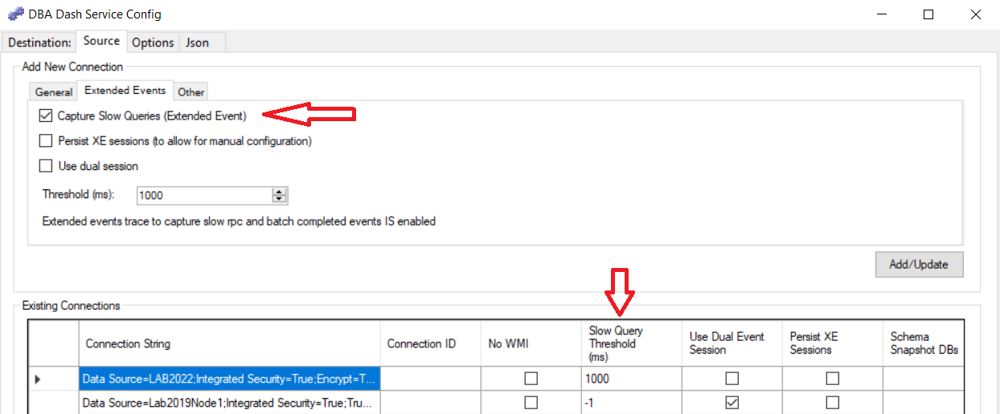
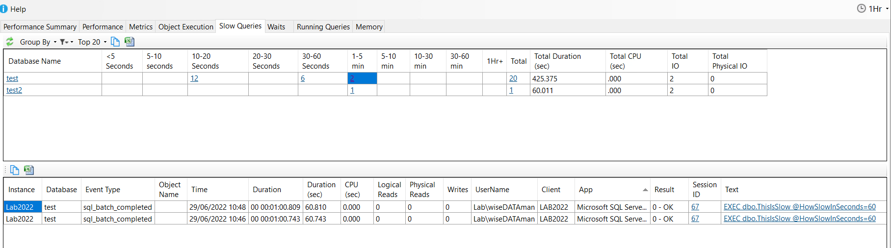
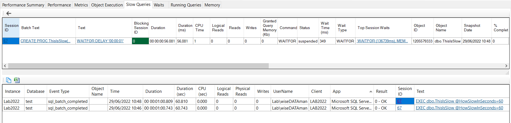
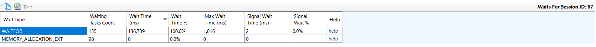
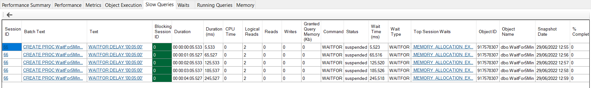
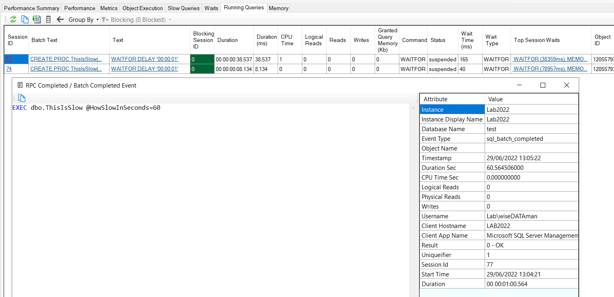

# Slow Queries

Slow query capture uses an extended event session to capture queries (batch_completed and rpc_completed events) that take longer than a specified threshold to run.  Slow Query capture needs to be enabled in the service configuration tool when adding your source connection.

## Before Enabling

Slow query capture is disabled by default as it will add a small amount of overhead.  Also, you might want to tweak the thresholds for your server.  If you enable slow query capture, the associated table in the repository database could grow quite large depending on the activity on your monitored instances, the thresholds used and the data retention settings. That said, the data collected is very useful and can help troubleshoot performance issues.  The collection uses extended events and the overhead of the collection should still be very small.  

> **Note**
>  **Please ensure your SQL instance is patched to a recent CU**.  There have been some [issues](https://support.microsoft.com/en-us/topic/kb4051359-fix-sql-server-runs-out-of-memory-when-table-valued-parameters-are-captured-in-extended-events-sessions-in-sql-server-2016-even-if-collecting-statement-or-data-stream-isn-t-enabled-a3639efa-0618-82a8-f6b1-8cdcba29ce6d) with the OBJECTSTORE_LBSS memory clerk using a lot of space on older patch levels when using extended events.  If you are on a recent patch level it's unlikely that slow query capture will have any significant impact.  

> **Note**
>  The Memory tab in DBA Dash can be used to track memory clerk usage over time which can help with the diagnosis of memory clerk issues.

## Configuring

**New Connections:**
* Add a new connection using the Service Configuration tool.  Before adding the connection, click the "Extended Events" tab.
* Click the "Capture Slow Queries" checkbox to enable slow query capture which will use a threshold value of 1000ms by default. 
* Edit the default threshold if required.
* Click Add/Update when you are ready to add the new connection



**Existing Connections:**

You can also edit the "Slow Query Threshold (ms)" column in the Existing Connections grid after adding an instance.  A value of -1 will disable slow query capture or specify a value of 1000 to capture queries that take longer than 1 second to run.  

### Persist XE Sessions (Advanced option)

When the DBA Dash service is stopped the event sessions it creates on the source connections are removed as a cleanup operation.  This ensures that you benefit from any changes made to the event session in newer versions of DBA Dash.  It also removes the need for a manual cleanup of the event sessions if you decide to remove DBA Dash (Though it's possible the sessions won't be dropped if the shutdown isn't graceful or the instance couldn't be contacted).

There is an option to "Persist XE Sessions" which will stop the event session instead of removing it.  This allows for a more advanced manual configuration of the event session.  For example, adding additional filters.  If you want to do this, enable the "Persist XE Sessions" option in the service configuration tool.  Save the configuration changes and restart the service.  You can now modify the event session manually as required.  The app is currently only designed to process rpc_completed and batch_completed events.

### Use dual session (Advanced option)

The app uses the ring_buffer target which stores the captured queries in memory.  Every time the slow query capture runs (default every 1min), the buffer is sent to the app.  The event sessions are stop/started as a way of flushing the data in the buffer.  There is a chance that some queries will be missed during the stop/start process so there is an option to "Use dual session".  This creates two event sessions where both will run for a short overlapping period in an attempt to avoid missing data. In both scenarios, there is no guarantee that all queries will be captured and the event session itself is configured to allow event loss (To prioritize performance over data capture).

### Azure DB

If you use elastic pools in Azure DB, you might see this error when enabling slow query capture:

> Operation will cause database event session memory to exceed allowed limit.

To fix this error, you can set the "Slow Query Target Max Memory (KB)" in the existing connections grid in the service configuration tool.  If you run this query, the "total_target_memory" column should show what value is configured.

```SQL
SELECT * FROM sys.dm_xe_database_sessions
```

I see a value of 32MB (in bytes) when the max_memory target parameter hasn't been set.  Using a smaller value can allow the event sessions to be created.

This query can be used to show the max_memory target parameter as configured:

```SQL
SELECT e.*,f.value as max_memory 
FROM sys.database_event_sessions e
LEFT JOIN sys.database_event_session_fields f ON e.event_session_id = f.event_session_id AND f.name = 'max_memory'
```

## GUI

Once you have enabled slow query capture for your monitored instance you will see data in the Slow Queries tab:



You can group and filter the data as required using the menu options.  In the screenshot above we have the default grouping of "Database" and we have clicked to view queries taking 1-5mins in the test database.  We can see two queries that took just over 1min to run along with the query text.  One of the best things the slow query capture gives us is the "Text" column.  We can see what was executed along with the parameter values passed in (for batch and rpc completed events).  This provides us with the data we need to try to reproduce the issue.

**Why were these queries slow?**

The first thing to observe is the huge difference in Duration and CPU time.  There can be several explanations for this.  For example, the query was blocked or had to wait a long time for IO?  We can see that the query had zero physical reads and writes which rules out an IO wait.  This could suggest blocking or some other wait. If the CPU time and Duration were closer it would suggest that the query had some real work to do.  If the CPU time was higher than the Duration it means we have some parallelism in the query.

Clicking the Session ID will return any running query snapshots captured while the query was running.  By default, the running queries snapshot only runs every 1min so we won't always have this data available depending on the duration of the query and when the execution started.  In this case, we can see 1 running query snapshot row - showing us what the query was doing 56.081 seconds into the query.



This gives us **a lot more data** to diagnose the problem.  We can see the query was running the statement "WAITFOR DELAY '00:00:01'".  We can also see this statement is run within the ThisIsSlow stored procedure (which runs the 1-second delay in a loop over @HowSlowInSecods iterations as a demo).  The Running Queries data potentially gives us a query plan (if plan capture is enabled and the query meets the threshold for collection).

The "Top Session Waits" column along with the current wait type can also provide insight into the root cause of the performance issue.  Clicking the top session waits gives you the session waits in a grid format:



The wait type WAITFOR accounts for the majority of the wait time.  In this case, the wait time is more than the query execution time - this is because the waits are cumulative for the session and this query was run multiple times from SSMS.  It's more typical for applications to execute a single query and close the connection - with the connection being returned to the connection pool for reuse (where the session waits will reset).  

There is much more information captured in the running queries snapshot that can help with the diagnosis - such as the blocking session, wait resource and more.  It's worth keeping in mind that the running queries data is just a point in time snapshot and won't always show you the statement responsible for the slow performance - just what happened to be executing when it ran.  For longer-running queries, you will have multiple snapshots available and be able to see what the query was doing at various points in its lifecycle.  Here we can see a query that took 5min and we have 5 snapshots available at 0:05, 1:05,2:05,3:05,4:05.  



In each snapshot, we can see the same query running with the same wait WAITFOR.  The wait type isn't included in the top session waits yet as this is a single WAITFOR command that is still executing.  If I waited 1 second in a loop for 5min you would start to see the waits accumulate in the Top Session Waits.  

The Slow Queries data is also leveraged on the Running Queries tab. The Running Queries tab gives you a snapshot of queries running at a point in time (Similar to sp_WhoIsActive/sp_BlitzWho).  Clicking the "Session ID" column link will give you the associated data from the slow queries extended event.  This gives you the actual command issued from the client application (along with parameter values).  It also gives the completed runtime metrics for the duration, CPU, Reads/Writes, etc. 



Note: If you are looking at a recent running queries snapshot, you might need to wait for the queries to finish executing and for the data to be collected. Also, the data won't be available if the query didn't meet the threshold for collection (The default threshold is to capture queries that take longer than 1 second to run.)

## Why ring_buffer?

Why does DBA Dash use the ring_buffer target instead of event_stream?  The primary reason is the event_stream target doesn't support Azure DB.  The ring_buffer target works across all instance types. The ring_buffer also fits a bit easier with the DBA Dash collection mechanism where a job fires at regular intervals and collects data. Using event_stream, a thread would be required to process the stream.  It would also need to batch the events up for writing to the destination (at least for folder/s3 bucket destinations).  The event_stream target might not work as well in cases where there isn't good network connectivity between the DBA Dash agent and the SQL instance.

With the ring_buffer you have to collect the entire buffer or process the buffer to filter for new events.  DBA Dash flushes the buffer after collection by stop/starting the event session to avoid this.  Potentially this could lead to a small number of missed events which is why the [use dual session](#use-dual-session) option was added.  The event_stream target would have the advantage of only processing new events without the need to flush the buffer.  Also, the latency between the event capture and being available in the DBA Dash repository database could be reduced with the event_stream target.  The events could be written immediately to the repository database instead of waiting for the collection to run.  

Query capture using the ring_buffer works very well in practice.  

## Under the hood

DBA Dash is open source so you can see how slow query capture works under the hood as well as make contributions to improve it.  The following links point to the relevant code for slow query capture.  

Run on collection interval (Every 1min by default):

* [Collection query](https://github.com/trimble-oss/dba-dash/blob/main/DBADash/SQL/SQLSlowQueries.sql)
* [Collection query for Azure DB](https://github.com/trimble-oss/dba-dash/blob/main/DBADash/SQL/SQLSlowQueriesAzure.sql)

Run on Start/Stop of service if Persist XE Sessions is not enabled:

* [Remove event sessions](https://github.com/trimble-oss/dba-dash/blob/main/DBADash/SQL/SQLRemoveEventSessions.sql)
* [Remove event sessions (Azure DB)](https://github.com/trimble-oss/dba-dash/blob/main/DBADash/SQL/SQLRemoveEventSessionsAzure.sql)

Run on Start/Stop of service if Persist XE Sessions is enabled:

* [Stop event sessions](https://github.com/trimble-oss/dba-dash/blob/main/DBADash/SQL/SQLStopEventSessions.sql)
* [Stop event sessions (Azure DB)](https://github.com/trimble-oss/dba-dash/blob/main/DBADash/SQL/SQLStopEventSessionsAzure.sql)

Repository DB:

* [Import data to repository DB](https://github.com/trimble-oss/dba-dash/blob/main/DBADashDB/dbo/Stored%20Procedures/SlowQueries_Upd.sql)
* [Import associated metrics to repository DB](https://github.com/trimble-oss/dba-dash/blob/main/DBADashDB/dbo/Stored%20Procedures/SlowQueriesStats_Upd.sql)
* [Slow Queries Summary](https://github.com/trimble-oss/dba-dash/blob/main/DBADashDB/dbo/Stored%20Procedures/SlowQueriesSummary_Get.sql)
* [Slow Queries Detail](https://github.com/trimble-oss/dba-dash/blob/main/DBADashDB/dbo/Stored%20Procedures/SlowQueriesDetail_Get.sql)
