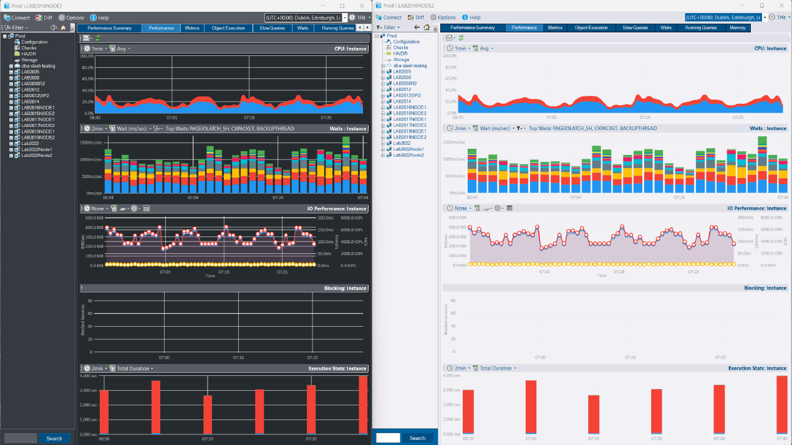

# DBA Dash - SQL Server Monitoring Tool

## Download

[Download](https://github.com/trimble-oss/dba-dash/releases)

## [Website](https://dbadash.com) 

Documentation is now available on [dbadash.com](https://dbadash.com), including an easy to follow [quick start](https://dbadash.com/docs/setup/quick-start/) guide.

## Project Summary

DBA Dash is a tool for SQL Server DBAs to assist with daily checks, performance monitoring and change tracking.  You can be up and running within minutes and it will provide you with a wealth of information that will make your life as a DBA easier.

- Daily DBA Checks
  - Backups
  - Last Good DBCC check
  - Corruption
  - Drive space
  - Agent Jobs
  - Availability Groups
  - Log Shipping
  - Mirroring
  - Identity Columns
  - [Custom Checks](https://dbadash.com/docs/help/custom-checks/) and more
- Performance
  - [OS Performance Counters + Custom Metrics](https://dbadash.com/docs/help/os-performance-counters/)
  - Stored Procedure/Function/Trigger execution stats
  - Waits
  - Memory
  - Snapshot of running queries
  - IO Performance
  - Blocking
  - [Capture slow queries](https://dbadash.com/docs/help/slow-queries/) (Extended Event trace)
  - Azure DB monitoring
- Track configuration
   - sys.configuration settings
   - SQL Patching
   - Hardware
   - Trace Flags
   - Alerts
   - Drivers
   - TempDB and Database files
   - Resource Governor
   - Database options
   - Query Store
   - [Schema changes](https://dbadash.com/docs/help/schema-snapshots/)

    *Track configuration across your SQL Server estate, automatically logging when changes occur*
    
- Agent Jobs
  - DDL Tracking
  - Agent job timeline view
  - Agent job performance monitoring
  - Highlight job failures across all your SQL instances
- Option to monitor instances in isolated environments via S3 bucket.

 [What DBA Dash collects and when](https://dbadash.com/docs/help/schedule/)

## Video Overview

## Requirements

- SQL Server 2016 SP1 or later required for DBADashDB repository database.  RDS & Azure DB is supported.  
- SQL 2008-SQL 2022 supported for monitored instances - including Azure and RDS (SQL Server).  
- Windows machine to run agent.  Agent can monitor multiple SQL instances.

## Prerequisites

- Account to use for agent.  Review the [security doc](https://dbadash.com/docs/help/security/) for required permissions. 
- [.NET Desktop Runtime 8](https://dotnet.microsoft.com/en-us/download/dotnet/8.0) is used by DBA Dash.  You will be prompted to install the .NET runtime version 6 if it's not already installed.

> **Note** 
> It's possible to run as a console app under your own user account for testing purposes.

## Installation

### 👋 [Quick start guide here](https://dbadash.com/docs/setup/quick-start/).

## Upgrades

### 👋 [See here for upgrade help](https://dbadash.com/docs/setup/upgrades/)

## Help

### 👋 [More help here](https://dbadash.com/docs/setup/quick-start/)
