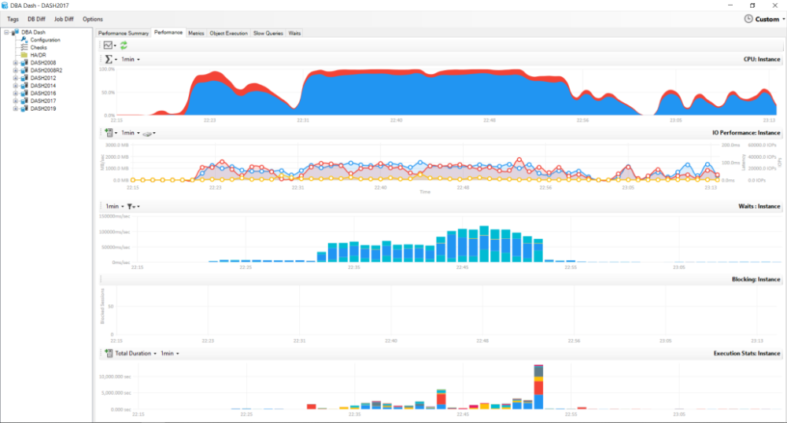

# DBA Dash - SQL Server Monitoring Tool



## Download

[Download](https://github.com/trimble-oss/dba-dash/releases)

## Project Summary

DBA Dash is a tool for SQL Server DBAs to assist with daily checks, performance monitoring and change tracking.

- Backups Agent Jobs, DBCC, Corruption, Drive space
- Availability Groups, Log Shipping, Mirroring
- [OS Performance Counters + Custom Metrics](Docs/OSPerformanceCounters.md)
- Stored Procedure/Function/Trigger execution stats
- Capture slow queries (Extended Event trace)
- Azure DB monitoring
- Track changes to configuration, SQL Patching, drivers etc.
- [Schema change tracking](Docs/SchemaSnapshots.md). 
- Agent Job change tracking
- Option to monitor instances in isolated environments via S3 bucket.
- [Custom Checks](Docs/CustomChecks.md)

 [What DBA Dash collects and when](Docs/Collection.md)

## Video Overview

[](https://www.youtube.com/watch?v=X7e4zElOQ3c)

## Requirements

- SQL Server 2016 SP1 or later required for DBADashDB repository database.  RDS & Azure DB is supported.  
- SQL 2008-SQL 2019 supported for monitored instances - including Azure and RDS (SQL Server).  
- Windows machine to run agent.  Agent can monitor multiple SQL instances.

## Prerequisites

- Account to use for agent.  Review the [security doc](Docs/Security.md) for required permissions. 
- [.NET Desktop Runtime 6](https://dotnet.microsoft.com/en-us/download/dotnet/6.0) is used by DBA Dash.  You will be prompted to install the .NET runtime version 6 if it's not already installed.

Note: It's possible to run as a console app under your own user account for testing purposes.

## Installation

- [Download](https://github.com/trimble-oss/dba-dash/releases) the latest version of DBA Dash.  Extract the files to a folder on your server and start the DBADashServiceConfigTool.exe tool.  The script below can be used to automate this:

````Powershell
$InstallPath = "C:\DBADash"

$Repo = "trimble-oss/dba-dash"

[Net.ServicePointManager]::SecurityProtocol = [Net.SecurityProtocolType]::Tls12
$Tag = (Invoke-WebRequest "https://api.github.com/repos/$Repo/releases/latest" | ConvertFrom-Json).tag_name

if (!(Test-Path -Path $InstallPath)){
    New-Item -Path $InstallPath -ItemType Directory
}

if ((Get-ChildItem -Path $InstallPath | Measure-Object).Count -gt 0){
    throw "Destination folder is not empty" 
}

cd $InstallPath
$zip = "DBADash_$Tag.zip"

$download = "https://github.com/$Repo/releases/download/$Tag/$zip"
Invoke-WebRequest $download -Out $zip

Expand-Archive -Path $zip -DestinationPath $InstallPath -Force -ErrorAction Stop

Start-Process DBADashServiceConfigTool.exe
````

- Use the configuration tool to set a destination connection.  (Where to create the DBA Dash repository database).  
  *Enter a connection string or click the connect icon to the right of the textbox to prompt for a connection.  The repository database will be created with the name specified as the initial catalog.* 
- Click the "Source" tab.
- Click the button to the right of the "Source" textbox to connect to the SQL Instance you want to monitor.  
 *Alternatively, the connection string can be entered manually.* 
 *Note: Connection strings are encrypted to avoid storing them in plain text but it is recommended to use Windows authentication - the encryption should be considered as obfuscation.*
- Review the "Extended Events" and "Other" tab for additional source configuration options.
- Click "Add/Update" to add the connection.  Repeat as necessary to add the other SQL Instances you want to monitor.  
 *Tip: You can add a connection string (Or server name list) per line in the source textbox to bulk add connections.*
- Click "Save".  A "ServiceConfig.json" file is created in the application folder that stores the configuration details for this agent.
- Click the "Destination" tab.
- Click "Install as a service".  Enter the credentials you want to use to run the service as and click "OK".  The credentials should be entered in "domain\username" format.
 *You can also run "DBADashService.exe" without installing as a service.  This runs the agent as a console application* 
- Close the command window.
- The service should now be installed and you can click the "Start" button to start the service.
 *Use the "View Service Log* button to see what the service is doing.  Click the "Refresh" button to update. * 
- Installation is now complete.  You can run the "DBADash.exe" application to get started using DBA Dash.  

**Note:**
More advanced service configuration is possible.  e.g. A remote agent can be configured to write to a S3 bucket and another agent that connects to your repository database can use the S3 bucket as a source instead of a SQL connection string.  
There are PowerShell scripts available to assist with automating the config file.  `Set-DBADashDestination,Add-DBADashSource,Remove-DBADashSource`
The release also has a GUI Only option which you can use to distribute the front-end to users of DBA Dash.  The front-end can also be run from a network share.

### Installation Video

[](https://www.youtube.com/watch?v=GY_4L049dVU)

## Upgrade Process

### Before upgrade

- Ensure you have a backup of the DBA Dash repository database
- Keep a backup of the ServiceConfig.json file.

### Upgrade

#### All versions

Run the following script from an elevated powershell prompt. Ensure the current directory is set to the DBA Dash installation folder:

```powershell
[Net.ServicePointManager]::SecurityProtocol = [Net.SecurityProtocolType]::Tls12
Invoke-WebRequest -Uri https://raw.githubusercontent.com/trimble-oss/dba-dash/main/Scripts/UpgradeDBADash.ps1 -OutFile UpgradeDBADash.ps1
./UpgradeDBADash.ps1
````

Upgrade to a specific version by specifying the tag:

`./UpgradeDBADash.ps1 -Tag 2.13.0`

The upgrade process checks if an upgrade is available and downloads the latest version.  The service is stopped along with any instances of the GUI.  The new files are extracted and the service is started up again.  You can perform these steps manually if you prefer.

#### Version 2.13 and later

From version 2.13 there is an "Upgrade" button on the About box to perform the upgrade process.  
You can also run:

`dbadashconfig -a Update`

Once the service is upgraded any GUI deployments running older versions will be prompted to upgrade.

#### Manual offline upgrade

[See here](https://github.com/trimble-oss/dba-dash/discussions/130)

## AzureDB

You can monitor Azure SQL Server databases with DBA Dash and the application includes some Azure specific dashboards that can help with performance/cost optimization. The process for adding Azure DB connections is similar to normal SQL instances but each database is considered a separate instance that we need a connection to.  You can manually add the connections for each database you want to monitor.  Alternatively you can just a connection to the **master** database.

If you have a connection to the master database, there are some options you can use on the "AzureDB" tab to add your other database connections:

- Check the "Scan for AzureDBs on service start" option.  As the name suggests database connections will be added from the master connection on service start.
- Check the "scan for new Azure DBs every 'x' seconds" option.  This is useful to pick up new AzureDBs.  Also if for some reason it fails to get the connections to your user databases on service start it would re-detect them on this interval.
- Click the "Scan Now" option.  Use this option to add the individual database connections to the config file.

Any database connections created from master will inherit the settings from the master connection for slow query capture etc.

## Amazon RDS

Amazon RDS (SQL Server only) can be used for source connections and for the repository database.  

## Monitoring "Remote"  Instances

It's possible to monitor instances where there isn't direct connectivity between the instance and your monitoring server. The destination you set in the DBA Dash Service config tool can be a folder path or point to a AWS S3 bucket.  You setup an agent in the remote environment to push data to the S3 Bucket location.  You then use that same location as a source connection on an agent where the destination is pointing to your DBADashDB central repository database.  The "AWS Credentials" tab can be used to specify credentials if required.  
If you chose to use a local folder instead of an S3 bucket then you would need to find a way to move files from that folder to a folder that can be accessed by the other agent connecting to your DBDashDB database.  An S3 bucket is the easiest option but you could use a local folder and sync via a different cloud storage provider.

---

## Documentation Links

- [Alerts](Docs/Alerts.md)
- [Collection](Docs/Collection.md)
- [Custom Checks](Docs/CustomChecks.md)
- [Developer Notes](Docs/developer.md)
- [FAQ](Docs/FAQ.md)
- [OS Performance Counters](Docs/OSPerformanceCounters.md)
- [Running Queries](Docs/RunningQueries.md)
- [Schema Snapshots](Docs/SchemaSnapshots.md)
- [Security](Docs/Security.md)