# DBA Dash - SQL Server Monitoring Tool

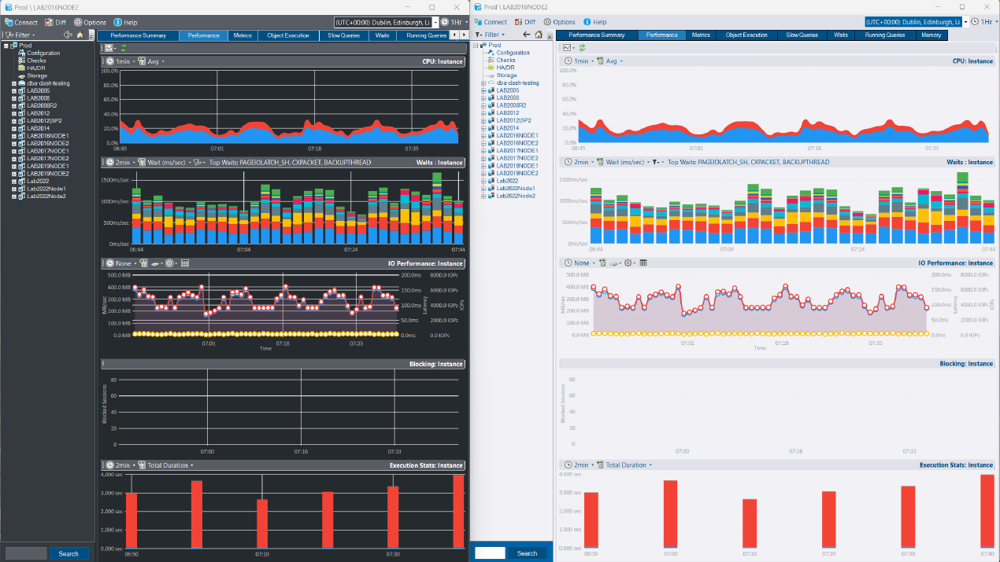

## Download

[Download the latest release](https://github.com/trimble-oss/dba-dash/releases/latest) - the release notes include a guide to which file to download.

## DBA Dash Visualizer

A small stand-alone app for viewing SQL Server execution plans (`.sqlplan`), deadlock graphs (`.xdl`) and result grids - no DBA Dash installation, repository or SQL Server connection needed.  It uses the same viewers that are built into DBA Dash.

- **Query plans** - operators ranked by cost, CPU, elapsed time, reads or estimate error, with badges for warnings, bad estimates, parallelism and missing indexes.  Insights highlight issues such as implicit conversions, scalar UDFs, excessive memory grants, catch-all parameters and missing partition elimination.
- **Plan comparison** - compare two plans side by side to see exactly what changed.
- **Deadlock graphs** - an interactive graph with findings that explain the deadlock.
- **Result grids** - sorting, filtering, Group By, data bars, and export to Excel, JSON, Markdown, HTML or SQL `INSERT` statements.

| | |
|---|---|
| [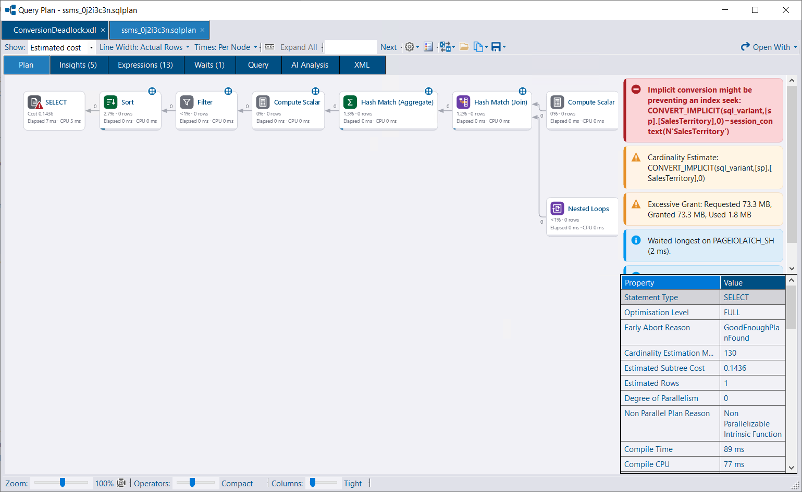](Docs/Screenshots/visualizer-plan.png) **Query plans** with insights | [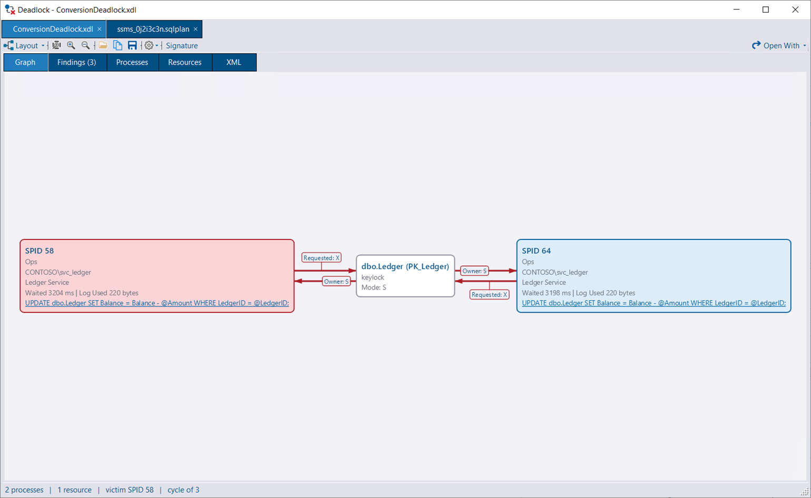](Docs/Screenshots/visualizer-deadlock.png) **Deadlock graphs** with findings |
| [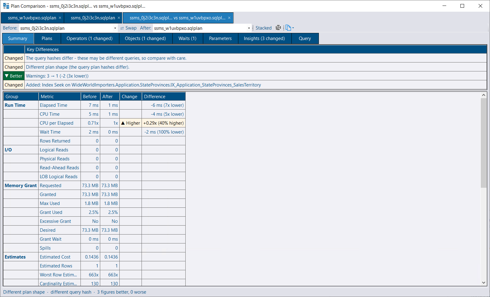](Docs/Screenshots/plan-compare-summary.png) **Plan comparison** | [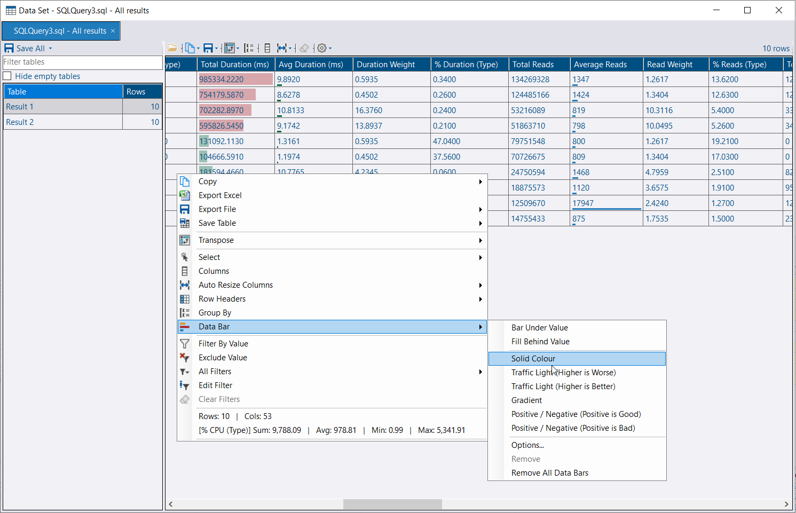](Docs/Screenshots/data-bar.png) **Result grids** with data bars |

Download the setup program (`DBADash_Visualizer_Setup_<version>.exe`, which updates itself) or the zip (`DBADash_Visualizer_<version>.zip`) from the [latest release](https://github.com/trimble-oss/dba-dash/releases/latest).  See the [DBA Dash Visualizer](https://dbadash.com/docs/help/dba-dash-visualizer/) documentation.

## SSMS Extension

An extension for SSMS 21 and 22 that adds **Open in DBA Dash Visualizer** to SSMS:

- **Execution plans** - from the execution plan right-click menu.
- **Deadlock graphs** - from deadlock graph tabs, or XML holding a plan or deadlock graph (e.g. `sp_BlitzLock` output).
- **Results grids** - one grid, or all the results from a query window in one go.

The option is also on the **Tools** menu (**Ctrl+Alt+Shift+D**).  Results opened in the Visualizer can be sorted, filtered, grouped and exported - or scripted as `INSERT` statements to re-create the results in a temp table.

| | |
|---|---|
| [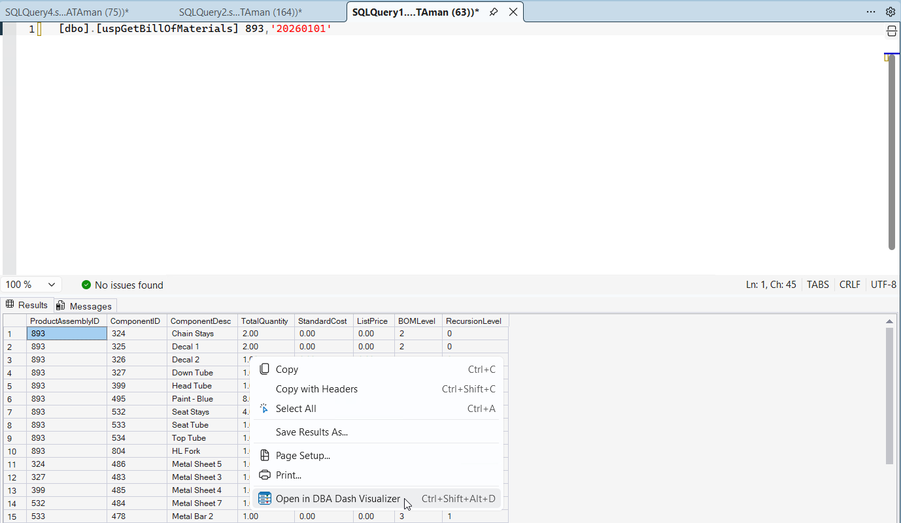](Docs/Screenshots/ssms-extension.png) **Open in DBA Dash Visualizer** from SSMS | [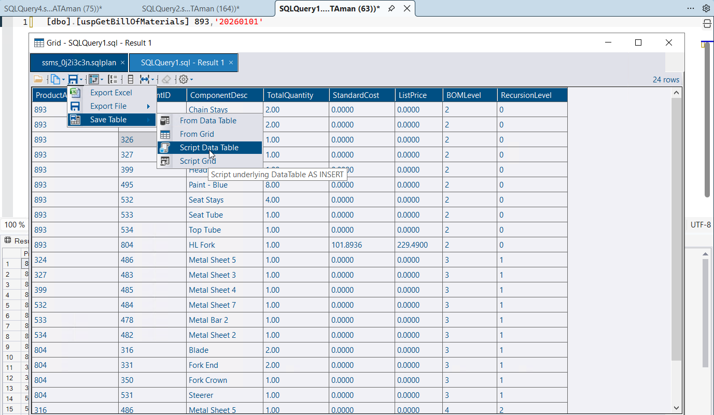](Docs/Screenshots/results-grid.png) **Results grids** - script as `INSERT`, save to a table, or export |

The extension is included with DBA Dash and the Visualizer.  Install it from **Options > SSMS Extension** in DBA Dash, or **Settings > Install SSMS Extension...** in the Visualizer.  See the [SSMS Extension](https://dbadash.com/docs/help/ssms-extension/) documentation.

## [Website](https://dbadash.com)

Documentation is available on [dbadash.com](https://dbadash.com), including an easy to follow [quick start](https://dbadash.com/docs/setup/quick-start/) guide.

## Project Summary

DBA Dash is a tool for SQL Server DBAs to assist with daily checks, performance monitoring and change tracking.  You can be up and running within minutes and it will provide you with a wealth of information that will make your life as a DBA easier.

- Daily DBA Checks
  - Backups
  - Last Good DBCC check
  - Corruption
  - Drive space
  - Agent Jobs
  - Availability Groups
  - Log Shipping
  - Mirroring
  - Identity Columns
  - [Failed Logins](https://dbadash.com/docs/help/failed-logins/)
  - [OS Loaded Modules](https://dbadash.com/docs/help/os-loaded-modules/)
  - [Custom Checks](https://dbadash.com/docs/help/custom-checks/) and more
- Performance
  - [Performance Summary](https://dbadash.com/docs/help/performance-summary/) across all your instances
  - [OS Performance Counters + Custom Metrics](https://dbadash.com/docs/help/os-performance-counters/)
  - Stored Procedure/Function/Trigger execution stats
  - Waits
  - Memory
  - [Snapshot of running queries](https://dbadash.com/docs/help/running-queries/)
  - IO Performance
  - Blocking
  - [Deadlocks](https://dbadash.com/docs/help/deadlocks/) - collection, reporting, signatures, viewer, static & AI analysis
  - [Capture slow queries](https://dbadash.com/docs/help/slow-queries/) (Extended Event trace)
  - [Ad-hoc Extended Events traces](https://dbadash.com/docs/help/extended-events/) across multiple instances
  - Azure DB monitoring, including read replicas
- Query plans & deadlocks
  - [Query Plan Viewer](https://dbadash.com/docs/help/query-plan-viewer/) - insights, plan comparison and optional AI analysis
  - [Deadlock Viewer](https://dbadash.com/docs/help/deadlocks/#deadlock-viewer) - findings and optional AI analysis
  - [DBA Dash Visualizer](https://dbadash.com/docs/help/dba-dash-visualizer/) - the plan and deadlock viewers as a stand-alone app, no DBA Dash installation needed
  - [SSMS Extension](https://dbadash.com/docs/help/ssms-extension/) - open plans, deadlock graphs and results grids from SSMS
- Track configuration
   - sys.configuration settings
   - SQL Patching
   - Hardware
   - Trace Flags
   - Alerts
   - Drivers
   - TempDB and Database files
   - Resource Governor
   - Database options
   - Query Store
   - [Schema changes](https://dbadash.com/docs/help/schema-snapshots/)

    *Track configuration across your SQL Server estate, automatically logging when changes occur*

- Agent Jobs
  - DDL Tracking
  - Agent job timeline view
  - Agent job performance monitoring
  - Highlight job failures across all your SQL instances
- [Alerts](https://dbadash.com/docs/help/alerts/) - with rules, thresholds and notification schedules tailored to your needs
- [AI Assistant](https://dbadash.com/docs/help/ai-assistant/) - ask natural-language questions about your SQL Server environment
- Extensibility
  - [Custom Collections](https://dbadash.com/docs/help/custom-collections/) & [Custom Reports](https://dbadash.com/docs/how-to/create-custom-reports/)
  - [Custom Tools](https://dbadash.com/docs/help/custom-tools/) - run your own stored procedures on monitored instances
  - [Community Tools](https://dbadash.com/docs/help/community-tools/) - sp_WhoIsActive, First Responder Kit & more
  - [Tagging](https://dbadash.com/docs/help/tagging/) - organize your instances
- Option to monitor instances in isolated environments via S3 bucket.

 [What DBA Dash collects and when](https://dbadash.com/docs/help/schedule/)

## Screenshots

| | |
|---|---|
| [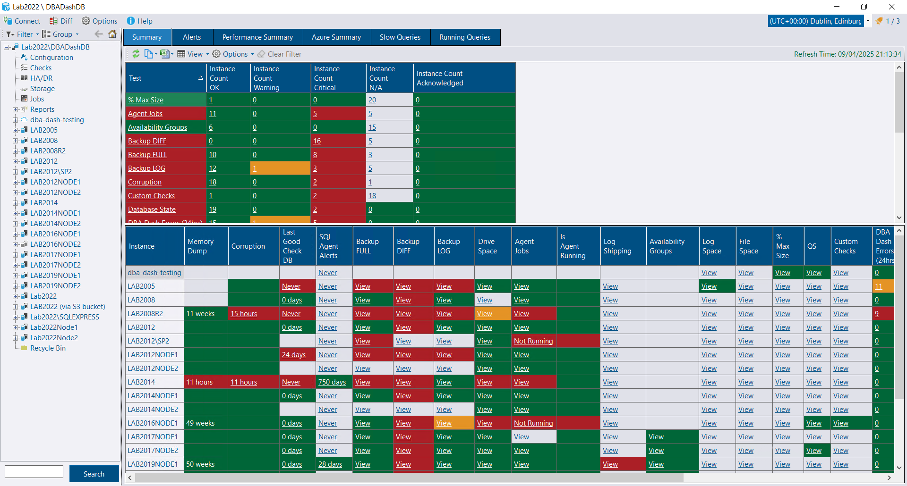](Docs/Screenshots/summary.png) **Daily checks** - the health of all your SQL instances on a single dashboard | [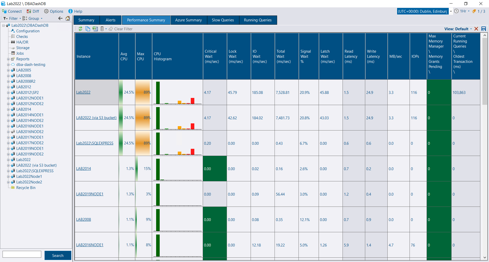](Docs/Screenshots/performance-summary.png) **Performance Summary** - key metrics for all your instances on one page |
| [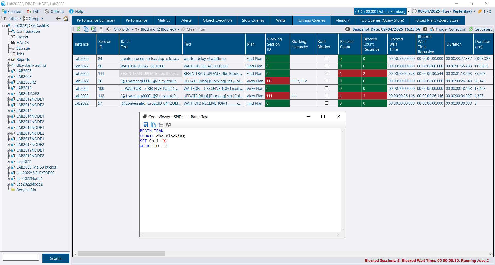](Docs/Screenshots/running-queries.png) **Running Queries** - what was running at any point in time, with blocking chains | [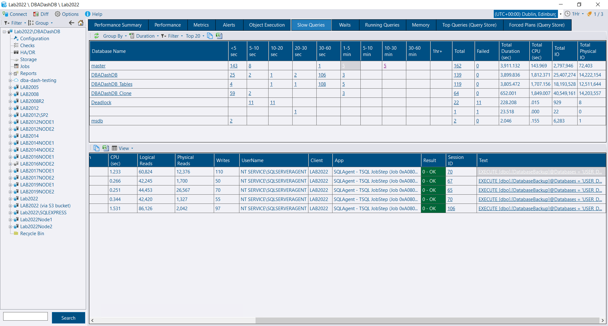](Docs/Screenshots/slow-queries.png) **Slow Queries** - captured with extended events |
| [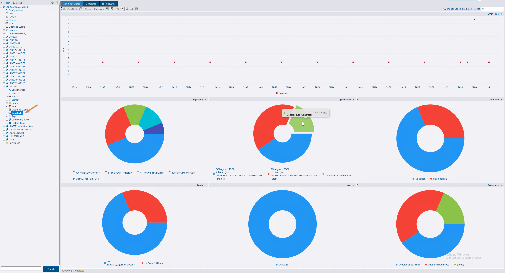](Docs/Screenshots/deadlock-charts.png) **Deadlocks** - tracked over time and grouped by signature |  **AI Analysis** - optional AI analysis of plans and deadlocks, with follow-up questions |

[More screenshots 📷](https://dbadash.com/docs/gallery/screenshots/)

## Video Overview

## Requirements

- SQL Server 2016 SP1 or later required for DBADashDB repository database.  RDS & Azure DB is supported.  
- SQL 2008-SQL 2022 supported for monitored instances - including Azure and RDS (SQL Server).  
- Windows machine to run agent.  Agent can monitor multiple SQL instances.

## Prerequisites

- Account to use for agent.  Review the [security doc](https://dbadash.com/docs/help/security/) for required permissions. 
- [.NET Desktop Runtime 10](https://dotnet.microsoft.com/en-us/download/dotnet/10.0) is used by DBA Dash.  You will be prompted to install the .NET runtime version 10 if it's not already installed.

> **Note** 
> It's possible to run as a console app under your own user account for testing purposes.

## Installation

### 👋 [Quick start guide here](https://dbadash.com/docs/setup/quick-start/).

## Upgrades

### 👋 [See here for upgrade help](https://dbadash.com/docs/setup/upgrades/)

## Help

### 👋 [More help here](https://dbadash.com/docs/setup/quick-start/)
